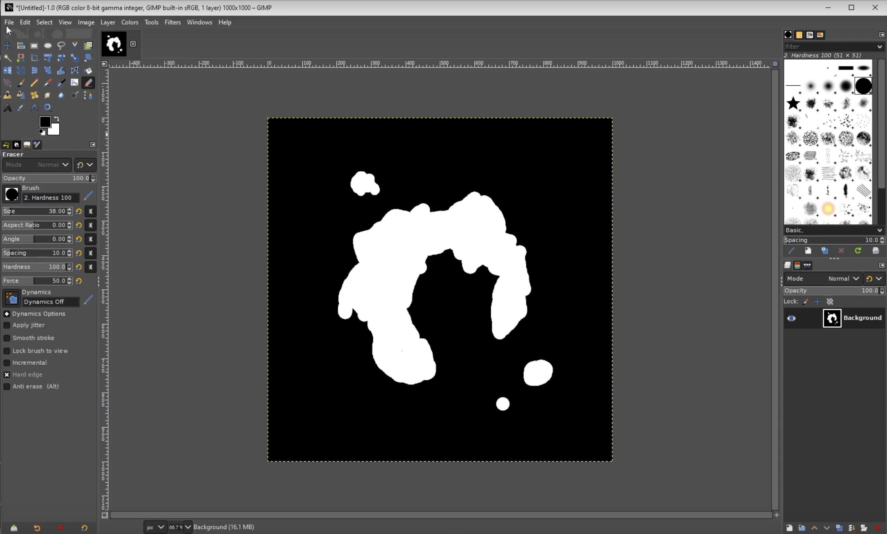
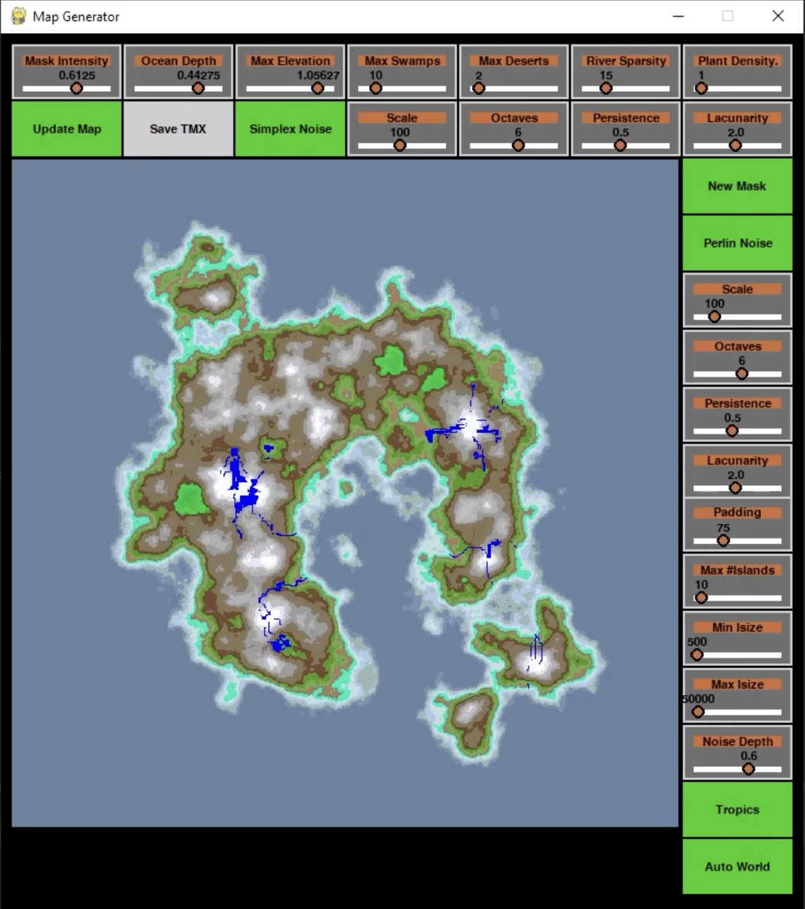
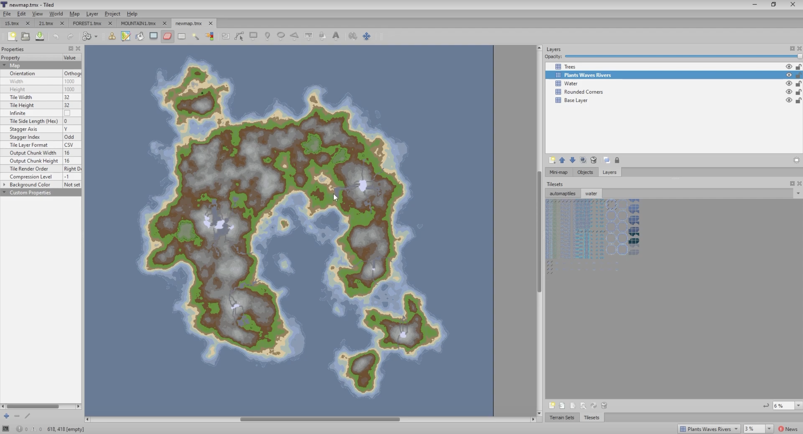

Automaptmx  
by Raven Ironwing (2021)

Automaptmx is a 2D orthogonal TMX ([Tiled Editor](https://www.mapeditor.org/)) map generator, suitable for use in RPG game development.

* Please see overview video: https://www.youtube.com/watch?v=iZUWHX8dyxU
* Written in Python

## Features

Automaptmx ...
* creates landscapes with mountains, lakes, rivers, swamps, deserts, oceans, beaches, and more 
* animates shoreline waves, and river water 
* adds trees and plants to landscapes
* rounds edges of map regions for a natural look
* reads a basic [image mask](masks) to design the water and land 
* imports a customizable Tiled tileset from a [Gimp](https://www.gimp.org/) XCF file
* exports a 1000 x 1000 tile [TMX](https://doc.mapeditor.org/en/stable/reference/tmx-map-format/) file

# How to use (basic)

1. `$ pip install -r requirements.txt` 
   1. Or use VENV, etc.
1. Update the landscape mask file: `mapmask1.png`
   1. **TRICKY**: Update mask before launching Automaptmx. Automaptmx reads the mask once, at launch.
   2. Mask resolution must be: 1000 x 1000
   3. Mask colors must be full black, or white
2. Launch `automaptmx.py`
2. Click "New Map". The landscape will be drawn.
3. Change any setting and "Update Map" until satisfied
4. Click "Save TMX"
   1. NOTE: Saving takes between 30 seconds and 10 minutes. See console command-line for progress.
2. Open the output TMX in Tiled: [tmx_maps/newmap.tmx](tmx_maps/newmap.tmx)
   1. Zoom in to see animated shoreline

# How it works

Automaptmx uses Perlin or Simplex noise to generate large scale landscapes.

## Masks

It combines a basic mask of the desired continent shape with noise. Then it transforms that noise into a colored image of the landscape which can be adjusted. Masks can be generated with Automaptmx, easily drawn in Gimp or your favorite image editor.

## Export

Once you like the landscape it can be exported to TMX format. 

The map tiles are block based. The edges are automatically rounded using replace algorithms and overlay layers. 

This kind of map is optimal for tile based object detection like walls, water, long grass, lava, etc.

The tileset template is in Gimp (XCF) format and can be easily edited to create new biome types.

